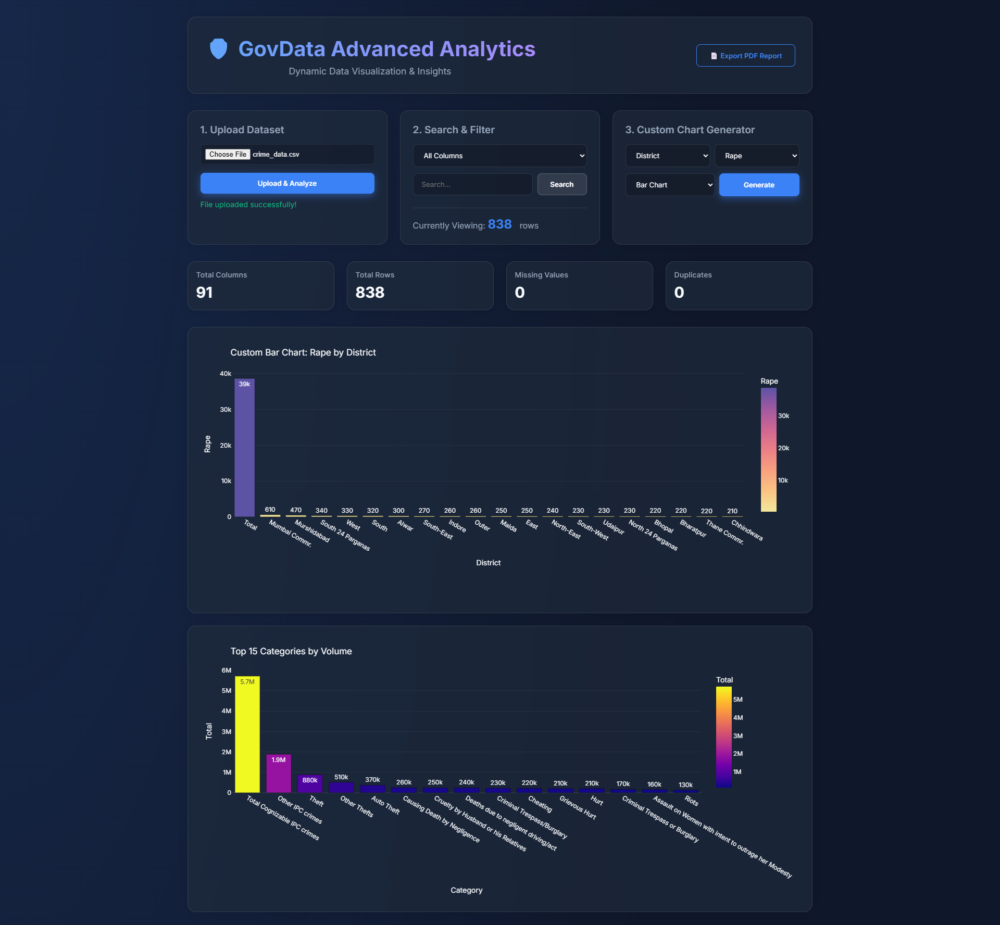
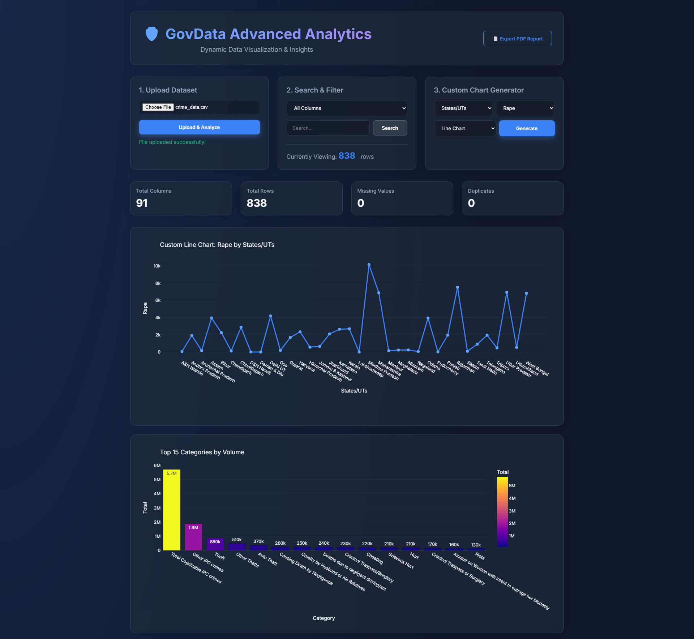
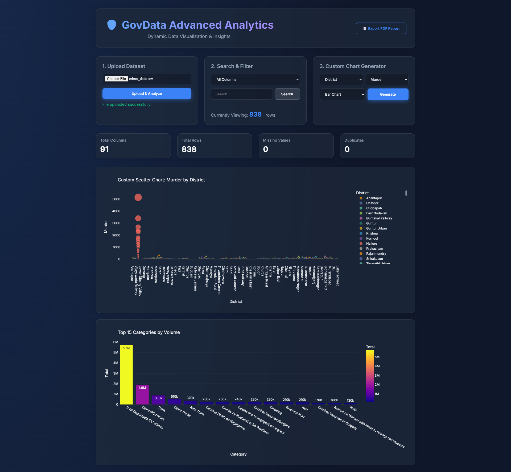

# 🛡️ GovData Advanced Crime Analytics

**GovData Advanced Crime Analytics** is a robust, dynamic data visualization dashboard built with Python, Flask, Pandas, and Plotly. Designed with a premium "glassmorphism" aesthetic, this tool empowers users to effortlessly upload, explore, filter, and visualize complex datasets (like government crime data) directly in their web browser.

## ✨ Features

- 📁 **Universal File Uploads**: Instantly ingest `.csv`, `.xls`, `.xlsx`, and `.json` datasets.
- 🪄 **Auto-Generated Insights**: The Pandas backend analyzes your dataset structure and intelligently auto-generates beautiful Plotly charts (Trendlines, Distributions, Proportions, and Aggregations).
- 🛠️ **Custom Chart Generator**: Build your own graphs on the fly! Select your X-Axis, Y-Axis, and choose between Bar, Line, Pie, and Scatter plots.
- 🔍 **Advanced Search & Filter**: Perform global searches across your entire dataset or target specific columns. Charts and metrics update in real-time.
- 📊 **Dynamic Data Preview**: View the raw data feeding your charts with pagination/row limit controls to keep the browser running smoothly.
- 📄 **One-Click PDF Export**: Easily export your entire dashboard configuration—including interactive charts and data tables—into a clean PDF report.
- 🎨 **Premium UI/UX**: Fully responsive, dark-mode glassmorphic design that looks stunning on desktop and mobile.

## 💻 Tech Stack

**Backend:**
- [Python 3.x](https://www.python.org/)
- [Flask](https://flask.palletsprojects.com/) (Web Server & API)
- [Pandas](https://pandas.pydata.org/) (Data Manipulation & Aggregation)
- [Plotly Express](https://plotly.com/python/) (JSON Chart Generation)
- [OpenPyXL](https://openpyxl.readthedocs.io/) (Excel Support)

**Frontend:**
- HTML5 / CSS3 (Vanilla, custom UI tokens)
- Vanilla JavaScript (ES6+)
- [Plotly.js](https://plotly.com/javascript/) (Interactive Frontend Rendering)
- [html2pdf.js](https://github.com/eKoopmans/html2pdf.js) (PDF Generation)

## 📸 ScreenShots





## 🚀 Installation & Setup

1. **Clone the repository:**
   ```bash
   git clone https://github.com/yourusername/govdata-analytics.git
   cd govdata-analytics
   ```

2. **Create and activate a virtual environment:**
   ```bash
   # Windows
   python -m venv venv
   .\venv\Scripts\activate

   # Mac/Linux
   python3 -m venv venv
   source venv/bin/activate
   ```

3. **Install dependencies:**
   ```bash
   pip install -r requirements.txt
   ```

4. **Run the application:**
   ```bash
   python app.py
   ```

5. **Open the Dashboard:**
   Open your browser and navigate to `http://localhost:5000`

## 📖 How to Use

1. **Upload**: Click the "Choose File" button to upload your dataset.
2. **Filter**: Use the dropdown and search bar to narrow down the data. Watch the summary metrics (Total Rows, Missing Values, etc.) instantly update.
3. **Customize**: Under "Custom Chart Generator", select your axes and chart type, then click "Generate" to visualize specific relationships.
4. **Export**: Click the "Export PDF Report" button in the top right to save your current view.

## 📂 Project Structure

```text
govdata-analytics/
├── app.py                # Main Flask application and API routes
├── requirements.txt      # Python dependencies
├── .gitignore            # Git ignore file
├── uploads/              # Temporary storage for uploaded datasets
├── static/
│   ├── css/
│   │   └── style.css     # Premium styling, animations, and grid layouts
│   └── js/
│       └── main.js       # Frontend logic, API fetching, Plotly rendering
└── templates/
    └── index.html        # Main dashboard HTML structure
```

## 🤝 Contributing
Contributions, issues, and feature requests are welcome! Feel free to check [issues page](#).
